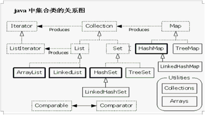
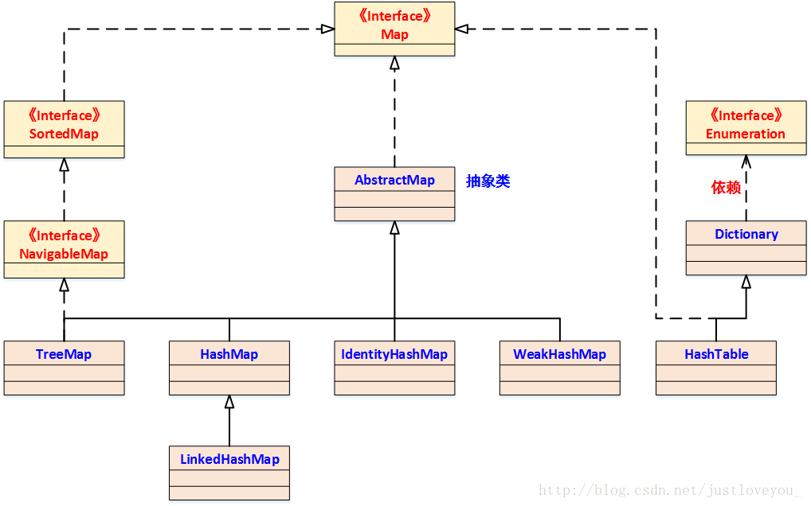
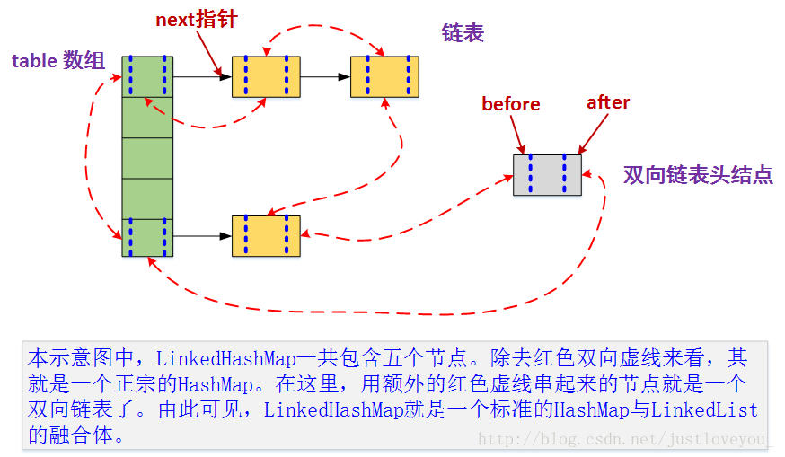
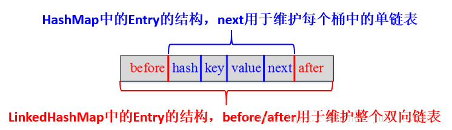
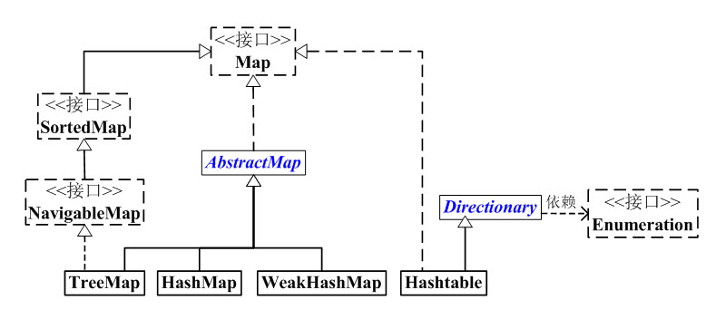

### HashMap & LinkedHashMap & HashTable

#### HashMap
-  HashMap的数据结构： 在java编程语言中，最基本的结构就是两种，一个是数组，另外一个是模拟指针（引用），所有的数据结构都可以用这两个基本结构来构造的，HashMap也不例外。HashMap实际上是一个“链表散列”的数据结构，即数组和链表的结合体。
- HashMap是基于哈希表的Map接口的非同步实现。此实现提供所有可选的映射操作，并允许使用null值和null键。此类不保证映射的顺序，特别是它不保证该顺序恒久不变



```java
public class HashMap<K,V>
    extends AbstractMap<K,V>
    implements Map<K,V>, Cloneable, Serializable
{
```

- put函数大致的思路为：
1. 对key的hashCode()做hash，然后再计算index;
2. 如果没碰撞直接放到bucket里；
3. 如果碰撞了，以链表的形式存在buckets后；
4. 如果碰撞导致链表过长(大于等于TREEIFY_THRESHOLD)，就把链表转换成红黑树；
5. 如果节点已经存在就替换old value(保证key的唯一性)
6. 如果bucket满了(超过load factor*current capacity)，就要resize。
- get函数大致思路如下：
1. bucket里的第一个节点，直接命中；
2. 如果有冲突，则通过key.equals(k)去查找对应的entry
若为树，则在树中通过key.equals(k)查找，O(logn)；
若为链表，则在链表中通过key.equals(k)查找，O(n)。

- hash定位
```java
int hash = hash(k);
int i = indexFor(hash, table.length);

static int hash(Object x) {
　　int h = x.hashCode();

　　h += ~(h << 9);
　　h ^= (h >>> 14);
　　h += (h << 4);
　　h ^= (h >>> 10);
　　return h;
}

static int indexFor(int h， int length) {
　　return h & (length-1);
}
```
通过对key的hashCode()进行hashing，并计算下标( n-1 & hash)，从而获得buckets的位置。如果产生碰撞，则利用key.equals()方法去链表或树中去查找对应的节点。
如果超过了负载因子(默认0.75)，则会重新resize一个原来长度两倍的HashMap，并且重新调用hash方法
- 时间复杂度:O(1)  空间复杂度:(n)


#### LinkedHashMap
- HashMap和双向链表合二为一即是LinkedHashMap。所谓LinkedHashMap，其落脚点在HashMap，因此更准确地说，它是一个将所有Entry节点链入一个双向链表的HashMap。
- 由于LinkedHashMap是HashMap的子类，所以LinkedHashMap自然会拥有HashMap的所有特性。比如，LinkedHashMap的元素存取过程基本与HashMap基本类似，只是在细节实现上稍有不同。当然，这是由LinkedHashMap本身的特性所决定的，因为它额外维护了一个双向链表用于保持迭代顺序。
- LinkedHashMap增加了时间和空间上的开销，但是它通过维护一个额外的双向链表保证了迭代顺序。特别地，该迭代顺序可以是插入顺序，也可以是访问顺序。因此，根据链表中元素的顺序可以将LinkedHashMap分为：保持插入顺序的LinkedHashMap和保持访问顺序的LinkedHashMap，其中LinkedHashMap的默认实现是按插入顺序排序的
- 在LinkedHashMapMap中，所有put进来的Entry都保存在如下面第一个图所示的哈希表中，但由于它又额外定义了一个以head为头结点的双向链表(如下面第二个图所示)，因此对于每次put进来Entry，除了将其保存到哈希表中对应的位置上之外，还会将其插入到双向链表的尾部。





```java
/**
 * Called by superclass constructors and pseudoconstructors (clone,
 * readObject) before any entries are inserted into the map.  Initializes
 * the chain.
*/
@Override
void init() {
    header = new LinkedHashMapEntry<>(-1, null, null, null);
    header.before = header.after = header;
}
```
1. 重写了init()方法，用来初始化双向链表。
2. 此方法在hashmap中是空实现,如下代码，这个方法就是为了给子类使用的。
```java 
/**
 * Initialization hook for subclasses. This method is called
 * in all constructors and pseudo-constructors (clone, readObject)
 * after HashMap has been initialized but before any entries have
 * been inserted.  (In the absence of this method, readObject would
 * require explicit knowledge of subclasses.)
 */
void init() {
}
```



```java
/**
 * LinkedHashMap entry.
*/
private static class LinkedHashMapEntry<K,V> extends HashMapEntry<K,V> {
    // These fields comprise the doubly linked list used for iteration.
    LinkedHashMapEntry<K,V> before, after;

    LinkedHashMapEntry(int hash, K key, V value, HashMapEntry<K,V> next) {
        super(hash, key, value, next);
    }
    ....
}
```
1. LinkedHashMapEntry继承HashMapEntry但是多了两个属性，用来维护双向链表。

- puth函数
 LinkedHashMap没有对 put(key,vlaue) 方法进行任何直接的修改，完全继承了HashMap的 put(Key,Value) 方法，只是它对addEntry方法和createEntry()方法和Entry的recordAccess方法进行了重写。这些重写都是为了维护双向链表，和访问顺序。
- get函数
 get的时候，如果初始化时设置了访问顺序，则在get之后会将元素移到双向链表的末尾处。
- resize函数
 扩容的时候没有改变resize()方法，只是重写了transfer()，通过双向链表，比较方便的copy数据。

#### HashTable

```java 
public class Hashtable<K,V>
    extends Dictionary<K,V>
    implements Map<K,V>, Cloneable, java.io.Serializable {
    ....
}
```
- Hashtable同样是基于哈希表实现的，同样每个元素是一个key-value对，其内部也是通过单链表解决冲突问题，容量不足（超过了阀值）时，同样会自动增长。Hashtable也是JDK1.0引入的类，是线程安全的，能用于多线程环境中。Hashtable同样实现了Serializable接口，它支持序列化，实现了Cloneable接口，能被克隆。

   
#### HashMap HashTable区别



HashMap和Hashtable都实现了Map接口,但是继承不一样。
主要区别有：线程安全性，同步(synchronization)，以及速度。

1. Hashtable中key和value都不允许为null，而HashMap中key和value都允许为null（key只能有一个为null，而value则可以有多个为null）。但是如果在Hashtable中有类似put(null,null)的操作，编译同样可以通过，因为key和value都是Object类型，但运行时会抛出NullPointerException异常，这是JDK的规范规定的。
2. HashMap是非synchronized,而HashTable是synchronized，这意味着HashTabale是线程安全的，多线程可以共享一个hashmap;而如果没有正确同步的话，多线程是不能共享hashmap的。Java5提供了ConcurrentHashMap，他是替代hashtable的，比hashtable的扩展性更好。也可以通过下面的语句是hashmap同步：Map m = Collections.synchronizeMap(hashmap)
3. hashmap的迭代器(Iterator)是fail-fast迭代器，而hashtable的迭代器不是。所以当有其他线程改变了hashmap结构（增删元素），将会抛出ConcurrentModificationException异常。
4. 由于hashtable是线程安全的，所以在单线程的环境下它比hashmap要慢。
5. hashmap不能保证随着时间的推移map中的元素次序不变。
6. HashTable使用Enumeration，HashMap使用Iterator
7. 二者的存储结构和解决冲突的方法都是相同的,Hashtable中hash数组默认大小是11，增加的方式是 old*2+1。HashMap中hash数组的默认大小是16，而且一定是2的指数。
8. Hashtable计算hash值，直接用key的hashCode()，而HashMap重新计算了key的hash值，Hashtable在求hash值对应的位置索引时，用取模运算，而HashMap在求位置索引时，则用与运算，且这里一般先用hash&0x7FFFFFFF后，再对length取模，&0x7FFFFFFF的目的是为了将负的hash值转化为正值，因为hash值有可能为负数，而&0x7FFFFFFF后，只有符号外改变，而后面的位都不变。

```java
    //HashTable
    int hash = hash(key);
    int index = (hash & 0x7FFFFFFF) % tab.length;
    private static int hash(Object k) {
        return k.hashCode();
    }

    //HashMap
    int hash = sun.misc.Hashing.singleWordWangJenkinsHash(key);
    int i = indexFor(hash, table.length);

    static int indexFor(int h, int length) {
    // assert Integer.bitCount(length) == 1 : "length must be a non-zero power of 2";
        return h & (length-1);
    }
```
##### 小节

- HashMap	线程不安全	允许有null的键和值	效率高一点、	方法不是Synchronize的要提供外同步	有containsvalue和containsKey方法	HashMap 是Java1.2 引进的Map interface 的一个实现
HashMap是Hashtable的轻量级实现
- Hashtable	线程安全	不允许有null的键和值	效率稍低、	方法是是Synchronize的	有contains方法方法	、Hashtable 继承于Dictionary 类	Hashtable 比HashMap 要旧，java1.0引入

#### ConcurrentHashMap
ReenterLock  CAS segment