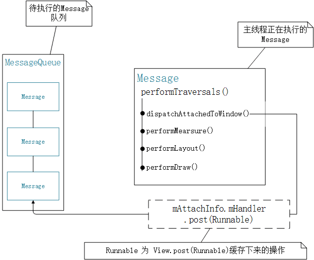

## View.post(Runnable)
1. 子线程不能进行UI操作 ，通过View.post() or View.postDelay() 来代替 Handler 使用。内部也是通过handler实现的。

2. View.post() 中的操作执行时，View 的宽高已经计算完毕，所以经常看见在 Activity 的 onCreate() 里调用 View.post() 来解决获取 View 宽高为0的问题。

3. 用 View.postDelay() 有可能导致内存泄漏.Handler 会造成内存泄漏的原因是由于内部类持有外部的引用，如果任务是延迟的，就会造成外部类无法被回收。而根据我们的分析，mAttachInfo.mHandler 只是 ViewRootImpl 一个内部类的实例，所以使用不当还是有可能会造成内存泄漏的。


```java 
    //View#post() 
    public boolean post(Runnable action) {
        final AttachInfo attachInfo = mAttachInfo;
        if (attachInfo != null) {
            return attachInfo.mHandler.post(action);
        }

        // Postpone the runnable until we know on which thread it needs to run.
        // Assume that the runnable will be successfully placed after attach.
        getRunQueue().post(action);
        return true;
    }
```
return true:runnable 成功放入消息队列 ，return false:通常是因为处理消息队列的looper正在退出

当mAttachInfo不为空的时候就调用mAttachInfor的handler的pos()处理。
HandlerActionQueue在dispatchAttachedToWindow()赋值，在dispatchDetachedFromWindow() 置空。
当mAttachInfo为空时使用view中的HandlerActionQueue处理。先通过数组缓存起来，通过executeActions(Handler handler)方法中的handler执行runnable。而executeActions(Handler handler)是在dispatchAttachedToWindow()中调用的.从代码中可以看到无论为空不为空，处理runnable的handler都是mAttachInfo中的handler，所以dispatchAttachedToWindow方法的调用时机很重要。

```java 
void dispatchAttachedToWindow(AttachInfo info, int visibility) {
        mAttachInfo = info;
    
        // Transfer all pending runnables.
        if (mRunQueue != null) {
            mRunQueue.executeActions(info.mHandler);
            mRunQueue = null;
        }
        performCollectViewAttributes(mAttachInfo, visibility);
        onAttachedToWindow();

    }
```

performTraversals() 这个方法应该是通知 Activity 的 View 树开始测量、布局、绘制。在performTraversals()方法中dispatchAttachedToWindow()被调用，通过这个方法把mAttachInfo传递给所有子view。也就是说，在 Activity 首次进行 View 树的遍历绘制时，ViewRootImpl 会将自己的 mAttachInfo 通过根布局 DecorView 传递给所有的子 View 。
```java
//mHandler#performTraversals() 
private void performTraversals() { 
    final View host = mView;  //mView 是 Activity 的 DecorView 

    if(mFirst) { 
        host.dispatchAttachedToWindow(mAttachInfo, 0); 
        //... 
    } 
 
}
```
在ViewRootImpl构造函数里对 mAttachInfo 进行初始化， 
```java 
mAttachInfo = new View.AttachInfo(mWindowSession, mWindow, display, this, mHandler, this); 
```
mHandler是ViewRootImpl的成员变量，在声明是初始化,绑定当前主线程的looper
```java 
final ViewRootHandler mHandler = new ViewRootHandler(); 
```
下图是测量绘制和dispatchAttachedToWindow()方法的massagequeue



总结:

1. View.post(Runnable) 内部会自动分两种情况处理，当 View 还没 attachedToWindow 时，会先将这些 Runnable 操作缓存下来；否则就直接通过 mAttachInfo.mHandler 将这些 Runnable 操作 post 到主线程的 MessageQueue 中等待执行。

2. 如果 View.post(Runnable) 的 Runnable 操作被缓存下来了，那么这些操作将会在 dispatchAttachedToWindow() 被回调时，通过 mAttachInfo.mHandler.post() 发送到主线程的 MessageQueue 中等待执行。

3. mAttachInfo 是 ViewRootImpl 的成员变量，在构造函数中初始化，Activity View 树里所有的子 View 中的 mAttachInfo 都是 ViewRootImpl.mAttachInfo 的引用。

4. mAttachInfo.mHandler 也是 ViewRootImpl 中的成员变量，在声明时就初始化了，所以这个 mHandler 绑定的是主线程的 Looper，所以 View.post() 的操作都会发送到主线程中执行，那么也就支持 UI 操作了。

5. dispatchAttachedToWindow() 被调用的时机是在 ViewRootImol 的 performTraversals() 中，该方法会进行 View 树的测量、布局、绘制三大流程的操作。

6. Handler 消息机制通常情况下是一个 Message 执行完后才去取下一个 Message 来执行（异步 Message 还没接触），所以 View.post(Runnable) 中的 Runnable 操作肯定会在 performMeaure() 之后才执行，所以此时可以获取到 View 的宽高。

参考文章：[微信公众号](https://mp.weixin.qq.com/s/laR3_Xvr0Slb4oR8D1eQyQ)
