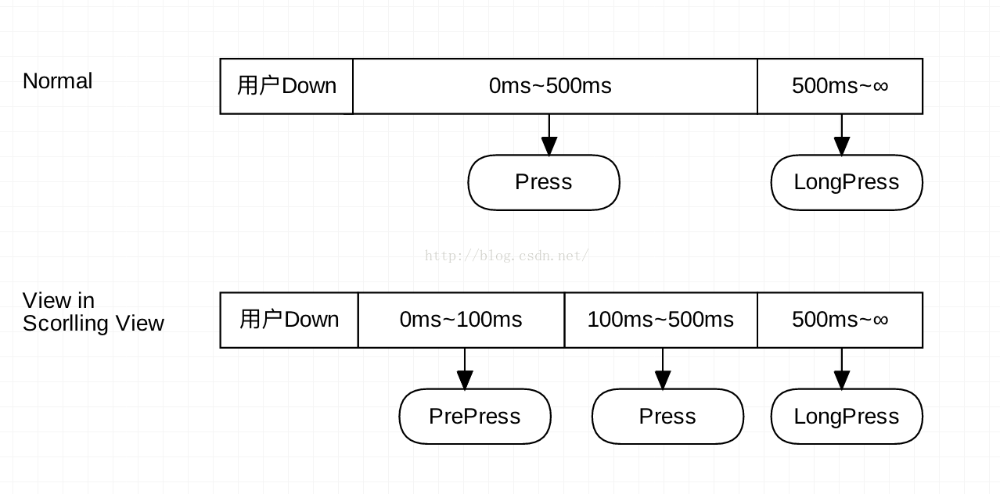

#### View


OnTouchListener在dispatch中，OnLongClickListener,OnClickListener在onTouchEvent中，先执行touchlistener ,再执行longclicklistener和clicklistener,long先于click,如果做了long就不能做click了，两个只能做一个。
```java
 /**传递触摸屏幕的手势事件给目标view，如果他是目标view，就直接给他。
     * 
     */
    public boolean dispatchTouchEvent(MotionEvent event) {
        // 辅助功能处理
        if (event.isTargetAccessibilityFocus()) {
            // We don't have focus or no virtual descendant has it, do not handle the event.
            if (!isAccessibilityFocusedViewOrHost()) {
                return false;
            }
            // We have focus and got the event, then use normal event dispatch.
            event.setTargetAccessibilityFocus(false);
        }

        boolean result = false;
//调试使用
        if (mInputEventConsistencyVerifier != null) {
            mInputEventConsistencyVerifier.onTouchEvent(event, 0);
        }

        final int actionMasked = event.getActionMasked();
        if (actionMasked == MotionEvent.ACTION_DOWN) {
            // Defensive cleanup for new gesture
            //嵌套滑动问题
            stopNestedScroll();
        }
//判断是否需要分发这个事件
        if (onFilterTouchEventForSecurity(event)) {
          //处理滚动条
            if ((mViewFlags & ENABLED_MASK) == ENABLED && handleScrollBarDragging(event)) {
                result = true;
            }
            //noinspection SimplifiableIfStatement
            ListenerInfo li = mListenerInfo;
            if (li != null && li.mOnTouchListener != null
                    && (mViewFlags & ENABLED_MASK) == ENABLED
                    && li.mOnTouchListener.onTouch(this, event)) {
                result = true;
                //OnTouchListener的处理
            }
//调用自己的onTouchEvent()方法进行处理
            if (!result && onTouchEvent(event)) {
                result = true;
              
            }
        }

        if (!result && mInputEventConsistencyVerifier != null) {
            mInputEventConsistencyVerifier.onUnhandledEvent(event, 0);
        }

        // 当手势结束时，或是down事件，但是该view不处理时都停止嵌套滑动
        if (actionMasked == MotionEvent.ACTION_UP ||
                actionMasked == MotionEvent.ACTION_CANCEL ||
                (actionMasked == MotionEvent.ACTION_DOWN && !result)) {
            stopNestedScroll();
        }

        return result;
    }


/**
     * 实现这个方法来处理屏幕的滑动事件
     * 如果用这个方法来检测单机操作，则建议通过实现和调用performClick()方法来* 执行操作。 这将保持系统操作的一致性，系统操作包括：点击声音按钮，分发* 
     OnClickListener回调，当辅助功能开启时处理
     * * AccessibilityNodeInfo#ACTION_CLICK ACTION_CLICK
     * 
     *
     * 参数是手势事件
     * 当事件被处理后返回true，否则返回false
     */
    public boolean onTouchEvent(MotionEvent event) {
      //获取时间的坐标
        final float x = event.getX();
        final float y = event.getY();
      //当前view的标记  VISIBILITY_MASK ENABLED_MASK 等等
        final int viewFlags = mViewFlags;
      //当前事件的action
        final int action = event.getAction();

        if ((viewFlags & ENABLED_MASK) == DISABLED) {
          //清理点击事件
            if (action == MotionEvent.ACTION_UP && (mPrivateFlags & PFLAG_PRESSED) != 0) {
                setPressed(false);
            }
            // 可点击的disable view 仍然能消费这个事件，只不过他不响应这个事件了
            return (((viewFlags & CLICKABLE) == CLICKABLE
                    || (viewFlags & LONG_CLICKABLE) == LONG_CLICKABLE)
                    || (viewFlags & CONTEXT_CLICKABLE) == CONTEXT_CLICKABLE);
        }
        //触摸事件代理 参见TouchDelegate类，这是一个帮助类，用来处理如下事件：如果你想让一个view有大于他实际边界更大的点击区域。
        if (mTouchDelegate != null) {
            if (mTouchDelegate.onTouchEvent(event)) {
                return true;
            }
        }

        if (((viewFlags & CLICKABLE) == CLICKABLE ||
                (viewFlags & LONG_CLICKABLE) == LONG_CLICKABLE) ||
                (viewFlags & CONTEXT_CLICKABLE) == CONTEXT_CLICKABLE) {
                  //view是可点击的则继续进行，否则返回false
            switch (action) {
                case MotionEvent.ACTION_UP:
                    boolean prepressed = (mPrivateFlags & PFLAG_PREPRESSED) != 0;
                    if ((mPrivateFlags & PFLAG_PRESSED) != 0 || prepressed) {
                        // take focus if we don't have it already and we should in
                        // touch mode.
                        boolean focusTaken = false;
                        if (isFocusable() && isFocusableInTouchMode() && !isFocused()) {
                            focusTaken = requestFocus();
                        }

                        if (prepressed) {
                            // The button is being released before we actually
                            // showed it as pressed.  Make it show the pressed
                            // state now (before scheduling the click) to ensure
                            // the user sees it.
                            setPressed(true, x, y);
                       }

                        if (!mHasPerformedLongPress && !mIgnoreNextUpEvent) {
                            // 判断是一个预点击，抬起时，清除长按监听
                            removeLongPressCallback();

                            // Only perform take click actions if we were in the pressed state
                            if (!focusTaken) {
                                // 响应点击事件
                                if (mPerformClick == null) {
                                    mPerformClick = new PerformClick();
                                }
                            //此处的post很眼熟啊View.post()
                                if (!post(mPerformClick)) {
                                    performClick();
                                }
                            }
                        }

                        if (mUnsetPressedState == null) {
                            mUnsetPressedState = new UnsetPressedState();
                        }

                        if (prepressed) {
                            postDelayed(mUnsetPressedState,
                                    ViewConfiguration.getPressedStateDuration());
                        } else if (!post(mUnsetPressedState)) {
                            // If the post failed, unpress right now
                            mUnsetPressedState.run();
                        }

                        removeTapCallback();
                    }
                    mIgnoreNextUpEvent = false;
                    break;

                case MotionEvent.ACTION_DOWN:
                    mHasPerformedLongPress = false;

                    if (performButtonActionOnTouchDown(event)) {
                        break;
                    }
                    //此判断暂过

                    // 判断此view是不是在一个可滚动的容器中。
                    boolean isInScrollingContainer = isInScrollingContainer();

                    // 如果view是在滚动视图中是，按压反馈延时一小会，时间很短的。100ms
                    if (isInScrollingContainer) {
                        mPrivateFlags |= PFLAG_PREPRESSED;
                        if (mPendingCheckForTap == null) {
                            mPendingCheckForTap = new CheckForTap();
                        }
                        mPendingCheckForTap.x = event.getX();
                        mPendingCheckForTap.y = event.getY();
                        postDelayed(mPendingCheckForTap, ViewConfiguration.getTapTimeout());
                    } else {
                    // 不是滚动的则立即反馈
                        setPressed(true, x, y);
                        //处理长按事件，长按时间为500ms
                        checkForLongClick(0, x, y);
                    }
                    break;

                case MotionEvent.ACTION_CANCEL:
                //移除预点击和长按的回调，回到初始状态。
                    setPressed(false);
                    removeTapCallback();
                    removeLongPressCallback();
                    mInContextButtonPress = false;
                    mHasPerformedLongPress = false;
                    mIgnoreNextUpEvent = false;
                    break;

                case MotionEvent.ACTION_MOVE:
                //将位置传给背景
                    drawableHotspotChanged(x, y);

                    // 判断事件是否在范围内移动，有8像素的误差范围
                    if (!pointInView(x, y, mTouchSlop)) {
                        // 如果在范围外移动，移除长按预点击的回调
                        removeTapCallback();
                        if ((mPrivateFlags & PFLAG_PRESSED) != 0) {
                            // 移除长按或是预点击检查
                            removeLongPressCallback();

                            setPressed(false);
                        }
                    }
                    break;
            }

            return true;
        }

        return false;
    }
```


- view的内部静态类 ListenerInfo 其中包含着OnClickListener，OnLongClickListener,OnTouchListener等监听事件。
```java
static class ListenerInfo {
        /**
         * Listener used to dispatch focus change events.
         * This field should be made private, so it is hidden from the SDK.
         * {@hide}
         */
        protected OnFocusChangeListener mOnFocusChangeListener;

        /**
         * Listeners for layout change events.
         */
        private ArrayList<OnLayoutChangeListener> mOnLayoutChangeListeners;

        protected OnScrollChangeListener mOnScrollChangeListener;

        /**
         * Listeners for attach events.
         */
        private CopyOnWriteArrayList<OnAttachStateChangeListener> mOnAttachStateChangeListeners;

        /**
         * Listener used to dispatch click events.
         * This field should be made private, so it is hidden from the SDK.
         * {@hide}
         */
        public OnClickListener mOnClickListener;

        /**
         * Listener used to dispatch long click events.
         * This field should be made private, so it is hidden from the SDK.
         * {@hide}
         */
        protected OnLongClickListener mOnLongClickListener;

        /**
         * Listener used to dispatch context click events. This field should be made private, so it
         * is hidden from the SDK.
         * {@hide}
         */
        protected OnContextClickListener mOnContextClickListener;

        /**
         * Listener used to build the context menu.
         * This field should be made private, so it is hidden from the SDK.
         * {@hide}
         */
        protected OnCreateContextMenuListener mOnCreateContextMenuListener;

        private OnKeyListener mOnKeyListener;

        private OnTouchListener mOnTouchListener;

        private OnHoverListener mOnHoverListener;

        private OnGenericMotionListener mOnGenericMotionListener;

        private OnDragListener mOnDragListener;

        private OnSystemUiVisibilityChangeListener mOnSystemUiVisibilityChangeListener;

        OnApplyWindowInsetsListener mOnApplyWindowInsetsListener;
    }
```
